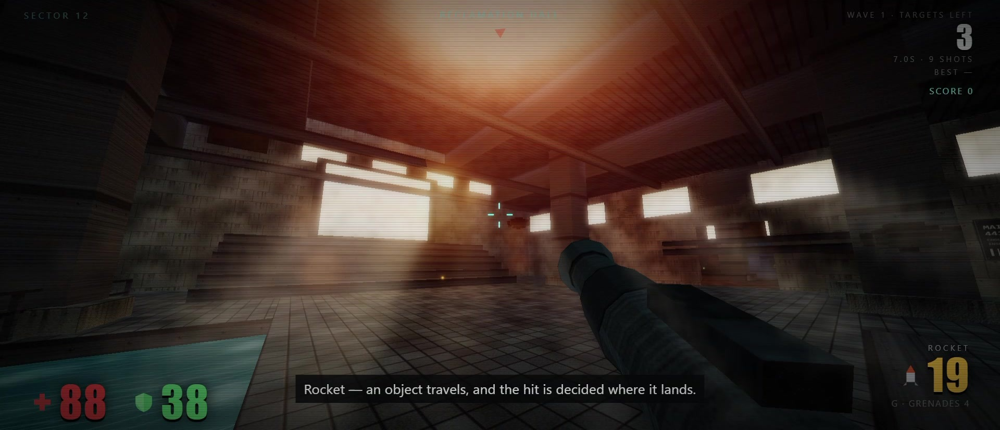

# Reclamation

A wave-based arena FPS that runs in the browser. Seven waves of machines in a flooded industrial sector, then endless mode for as long as you last.

**[▶ Play it](https://richardtokar.github.io/reclamation/)** · [itch.io page](https://richardtokar.itch.io/reclamation)

---

## The whole thing is one file

`index.html` is 317 KB and about 6,900 lines. That is the entire game. There is no engine, no build step, no `node_modules`, no asset folder, and **zero external requests** — nothing is fetched at runtime.

Everything you see and hear is generated in code at load time:

- **Textures** — concrete, rust, tile, water, and metal are painted procedurally onto canvases, then converted to normal maps by sampling their own luminance
- **Geometry** — the level is built from brushes, with ambient occlusion baked at startup by ray-casting against that geometry
- **Signage** — every sign, warning label, and stencil in the world is drawn with canvas calls, not authored as an image
- **Audio** — the whole soundscape is synthesised through the Web Audio API: oscillators, filtered noise bursts, and convolution. No sample files
- **Lighting** — a fixed set of static lights with per-frame selection of the nearest few, plus dynamic lights for muzzle flashes and explosions

Save the file, open it offline, and it still works.

## Playing

| Input | Action |
|---|---|
| Mouse | Look and fire |
| WASD | Move |
| Shift | Run |
| Space | Jump |
| C | Crouch |
| 1 / 2 / 3 or wheel | Rifle, shotgun, rockets |
| Q | Previous weapon |
| R | Reload |
| G | Grenade |
| V | Melee |
| F | Torch |
| Esc | Pause |

Desktop browser with a mouse. Click to capture the pointer.

## How it plays

Six machine types — **scout, gunner, heavy, boat, turret, stalker** — unlock progressively across seven waves. Waves are assembled from a threat budget rather than a fixed list, so composition varies run to run while staying inside a hard cap of 14 machines. Every third wave is a surge; the wave after a surge is a breather.

Clearing wave seven wins the run and unlocks endless mode.

### Scoring

Score is the wave's total threat multiplied by four independent factors:

| Factor | Range | Rewards |
|---|---|---|
| Speed | 0.35 – 1.9 | Clearing under par time |
| Accuracy | 0.15 – 1.0 | Not spraying |
| Weak point | 1.0 – 1.55 | Hitting cores rather than bodies |
| Clean | 0.30 – 1.0 | Not getting hit |

A fast, accurate, untouched clear is worth roughly 35× a slow sloppy one on the same wave. Difficulty enters through the wave's composition, not through a wave-number bonus — so a well-played early wave can outscore a badly-played late one.

## Performance

Quality is adaptive. The renderer measures frame time, filters it, and moves between four tiers by adjusting shadow resolution, effect density, and internal render scale.

Two details make it behave better than a naive fps threshold:

- **Promotion is normalised by pixel load.** A machine pushing 1.8× the pixels of 1080p at 40 fps is doing more work than one pushing 1080p at 58, and the promotion test accounts for that. Demotion deliberately stays on raw fps — whatever the maths says, 25 fps is 25 fps.
- **Touch devices get a hint, not a verdict.** Mobile starts the estimate lower rather than being locked to the bottom tier, so a fast phone can still earn the top one.

Hysteresis, cooldowns, and a filtered frame time mean it settles rather than oscillating. Everything is manually overridable, and touching a setting by hand stops auto-adjustment from fighting you on that specific setting.

## Running it locally

Download `index.html` and open it. That's the whole procedure — no server, no install, no build.

## Development notes

The project was built iteratively and then put through a structured audit pass near the end, driven by a headless test harness (jsdom plus stubbed 2D/WebGL contexts, a seeded PRNG, and a manual frame pump) that executes the real game logic without a GPU.

That pass found nine defects, including two that were quietly serious:

- **Grenades never exploded once they came to rest.** The fuse check sat after the collision branch, and that branch ended in an unconditional `continue`. A grenade at rest collides every step, so it was deleted at fuse time instead of detonating — which meant only grenades still airborne at 1.45 seconds ever went off.
- **Falling out of the world crashed the run.** The recovery path called `hurtPlayer(12, null)`, and the damage-direction indicator dereferenced that null. The one code path whose job was to rescue a fallen player was ending the run instead.

Both were invisible in normal play right up until they weren't. The rest were a suppressed-explosion guard left over from a removed cinematic, damage being counted while dead, a brace mis-nesting that made landing detection unreachable while stationary, stacked modal cards, an incomplete revive, and ungated input keys.

The lesson, for anyone reading this because they teach or are learning: the bugs that survive playtesting are the ones on paths you never deliberately exercise. Nobody lobs a grenade at their own feet to check that it explodes.

## Built with

Vanilla JavaScript, WebGL 1, Canvas 2D, and the Web Audio API. Nothing else.
